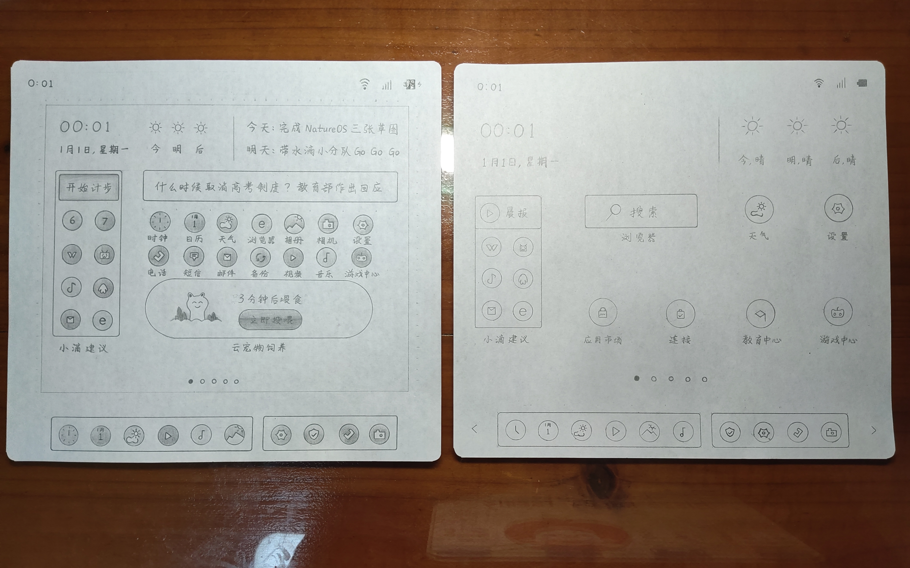
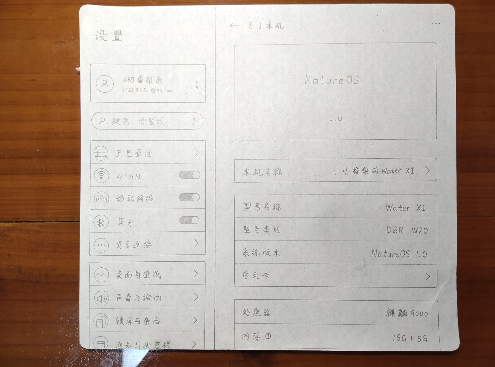
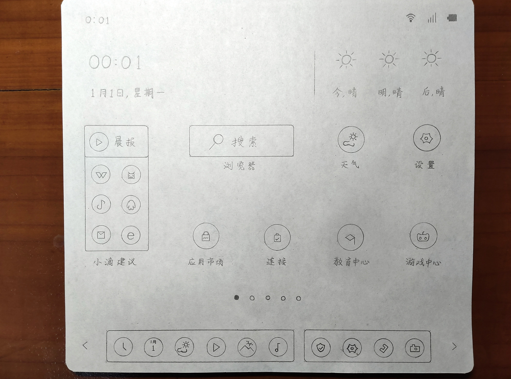

# Bingrui Operating System
#### We have a dream
We have a dream of building our own system. BingruiOS is a self-developed system imagined by our Water Drop Laboratory, aimed at creating convenient mobile phones (tablets) and computer systems for the Chinese people, and may even achieve connectivity with all things in the future.
The system colors are mainly natural colors, without pursuing bright UI trends or renovating outdated retro styles. We only create a unique style that belongs to our water droplets, allowing customers to feel a sense of intimacy with nature when using it.
In terms of future requirements for the system, there will be no shortage of arms and legs in terms of functionality; The overall performance and appearance need to be balanced... Therefore, the design cost may be higher and the development difficulty may be greater. But we sharpen our swords for ten years, not pursuing speed, not casually showing off semi-finished products to others, and focusing on creating a natural system that integrates people and things.
Considering that everyone has important tasks to attend to, in recent years, we have temporarily put aside the matter of creating a system. When we have time, our water droplet team will wholeheartedly do it well, let the system shine, and let us show off our brilliance!
That's all for the nonsense. Below are the desktop and settings for tablet (mobile) devices; Please take a look at the sketch of the desktop and settings on the computer side.

#### Description
Developed by WaterDrop Lab independently.

#### Software Architecture
Based on Linux.

#### Installation

1.  xxxx
2.  xxxx
3.  xxxx

#### Instructions

1.  xxxx
2.  xxxx
3.  xxxx

#### Contribution

1.  Fork the repository
2.  Create Feat_xxx branch
3.  Commit your code
4.  Create Pull Request

#### Gitee Feature

1.  You can use Readme\_XXX.md to support different languages, such as Readme\_en.md, Readme\_zh.md
2.  Gitee blog [blog.gitee.com](https://blog.gitee.com)
3.  Explore open source project [https://gitee.com/explore](https://gitee.com/explore)
4.  The most valuable open source project [GVP](https://gitee.com/gvp)
5.  The manual of Gitee [https://gitee.com/help](https://gitee.com/help)
6.  The most popular members  [https://gitee.com/gitee-stars/](https://gitee.com/gitee-stars/)
