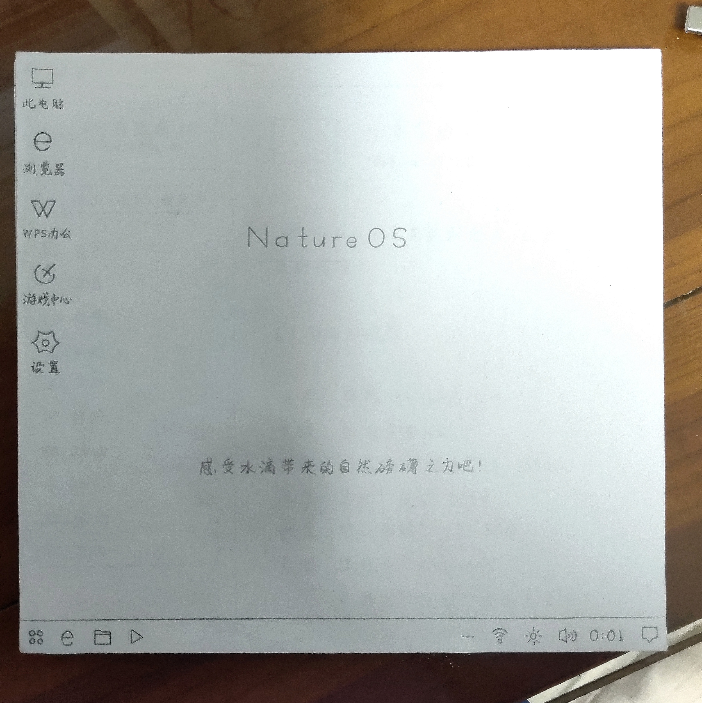
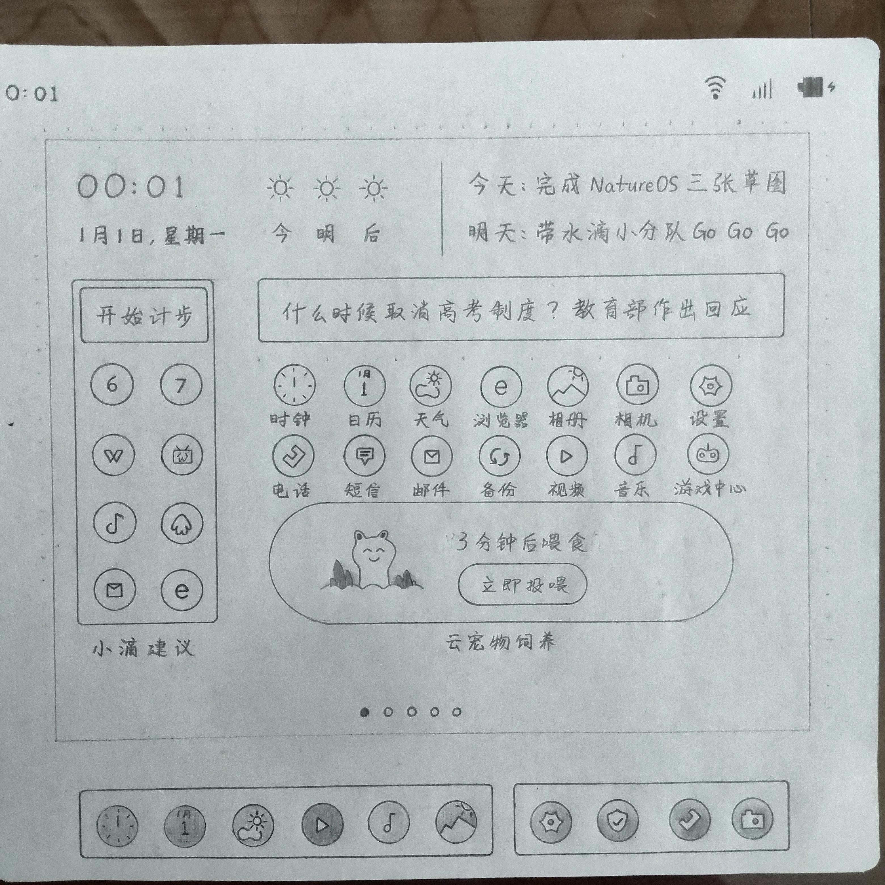
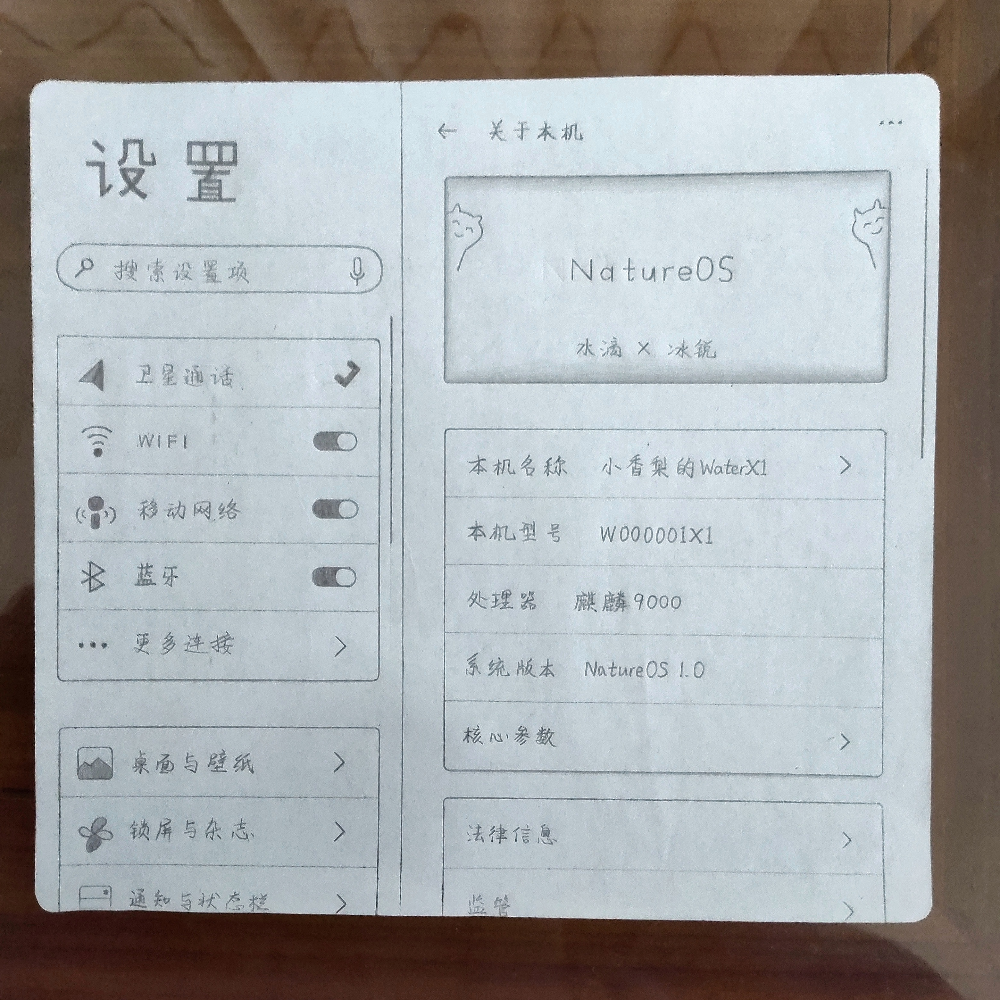

# 冰锐操作系统

#### 我们有一个梦想

我们有个梦想，希望打造拥有属于自己的系统。BingruiOS是我们水滴实验室幻想的自研系统，旨为中国人打造顺手的手机（平板）、电脑系统，未来甚至可能做到与万物相通…

系统色彩以自然色彩为主，不追求鲜艳的UI潮流，不翻新过时的复古风格，只做属于我们水滴独树一帜的风格，让客户在使用时感受与大自然融为一体的亲昵感。

未来对于系统的要求，功能方面不缺胳膊少腿；整体性能与外观要平衡…因此，设计成本可能较高，开发难度可能较大。但我们十年磨一剑，不追求速度，不随意向他人炫耀半成品，专注打造人、物合一的自然系统。

考虑到大家都有要务在身，近年来，咱们暂时把制作系统这事搁一搁。等抽空，我们水滴小组全心全力做好它，让系统焕发出生机，让我们展现出光彩！

废话就到此为止。下面是平板（手机）端桌面、设置；电脑端桌面、设置的草图，请大家看一下吧：

#### 介绍
水滴实验室自主研发的国产计算机/平板/手机操作系统

#### 软件架构
基于Linux架构，使用C/C++进行编程

#### 安装教程

1.  xxxx
2.  xxxx
3.  xxxx

#### 使用说明

1.  xxxx
2.  xxxx
3.  xxxx

#### 参与贡献

1.  Fork 本仓库
2.  新建 Feat_xxx 分支
3.  提交代码
4.  新建 Pull Request

#### 特技

1.  使用 Readme\_XXX.md 来支持不同的语言，例如 Readme\_en.md, Readme\_zh.md
2.  Gitee 官方博客 [blog.gitee.com](https://blog.gitee.com)
3.  你可以 [https://gitee.com/explore](https://gitee.com/explore) 这个地址来了解 Gitee 上的优秀开源项目
4.  [GVP](https://gitee.com/gvp) 全称是 Gitee 最有价值开源项目，是综合评定出的优秀开源项目
5.  Gitee 官方提供的使用手册 [https://gitee.com/help](https://gitee.com/help)
6.  Gitee 封面人物是一档用来展示 Gitee 会员风采的栏目 [https://gitee.com/gitee-stars/](https://gitee.com/gitee-stars/)
